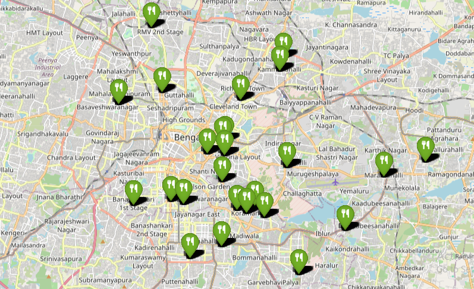
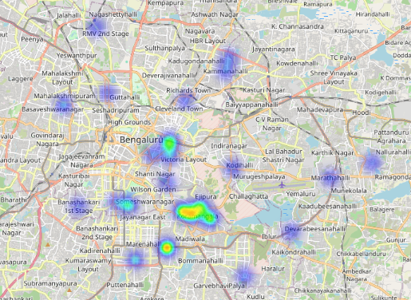

# Zomato Bangalore Restaurant Trends – EDA & Geo-Visualization Hackathon

This repository presents an insightful data exploration project based on the Zomato Bangalore restaurant dataset. The goal is to analyze customer preferences, cuisine trends, restaurant types, and geographic distribution of restaurants in Bangalore using interactive visualizations and statistical techniques.

🔍 What's Inside
📊 EDA (Exploratory Data Analysis):
Understand the most common restaurant types, rating distributions, cost analysis, and voting patterns.

🌍 Geo-Spatial Analysis with Folium:
Interactive maps showcasing restaurant density and cuisine-specific locations (e.g., Italian restaurants across Bangalore).

🍽️ Cuisine Insights:
Analyze the popularity of various cuisines and identify high-rated spots with 1000+ votes.

📍 Neighborhood Analysis:
Discover which areas have the highest concentration of restaurants, and how dining trends vary across localities

## Cuisine-Specific Map (Italian Restaurants)

## Restaurant Density Map

